## Exploring Longitudinal Vehicle Dynamics with SimscapeTM
This repository contains four distinct vehicle dynamics models, each with increasing complexity. The models will build step by step the longitudinal simulation shown in the figure below

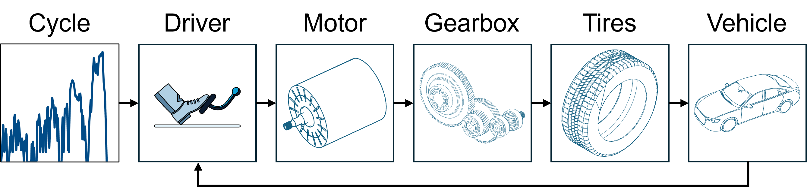 

The last model is a closed-loop system that can simulate different sets of drive cycles for consumption and range estimation. All models use the same parametrization script: [setVehicleParam.m](functions/setVehicleParam.m).

## The Fundamental Equation of Longitudinal Dynamics
The fundamental equation of the longitudinal dynamics is: 

$m_V a(t) = F_P - F_D - F_R - F_S$ 

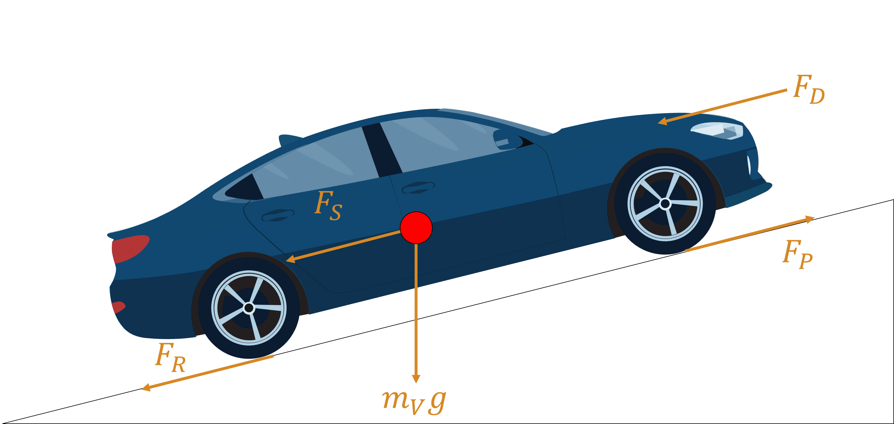 

The vehicle accelerates - and its acceleration at a given time is given by  $a(t)$ - as long as the traction force from the powertrain ($F_P$) is greater than the other resistances. 

The drag resistance $F_D$ is caused by the friction with the neighboring air and depends on air density $\rho_{air}$, vehicle speed, vehicle frontal area $A_{v}$, and drag coefficient $c_D$.

$F_D(t) = \frac{c_D A_{v} \rho_{air}}{2} v(t)^2$

The rolling resistance $F_R$ can be modeled in several ways. The easiest method is to express it as a proportion of the normal forces acting on the wheel the rolling coefficient factor: 

$F_R(t) = c_R m_{V} g \cos(\alpha)$ 

The slope resistance depends on the slope angle and vehicle mass. Assuming a constant slope angle $\alpha)$ it can be expressed as: 

$F_S(t) = m_{V} g \sin(\alpha)$ 

Besides the main losses shown in the fundamental equation of the longitudinal dynamic, other losses occur in the powertrain (e.g., in the gearbox or the motor). These losses will be shown in the following models.

## Vehicle and Tires
The model [vehicleModelBodyAndTires.slx](models/vehicleModelBodyAndTires.slx) implements a vehicle body and a tire model. A constant torque (100 Nm) is provided to the rear wheels, initiating their rotation and causing the vehicle body to translate. 

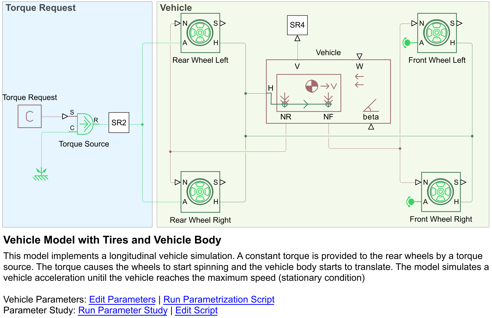 

The vehicle accelerates until the power generated by the torque source equals the total losses, at which point the vehicle reaches its maximum attainable speed. In this model, the losses include rolling and drag resistance. 
The figure below illustrates how increasing tire inertia affects vehicle acceleration. Specifically, higher tire inertia results in slower acceleration but does not alter the vehicle's top speed. 
This occurs because tire inertia stores energy rather than consuming it. With greater inertia, more time is required to accelerate the tires; however, given sufficient time, the vehicle ultimately achieves the same maximum speed. The maximum speed shown in the figure is the speed for which all losses are equal to the provided powertrain force 

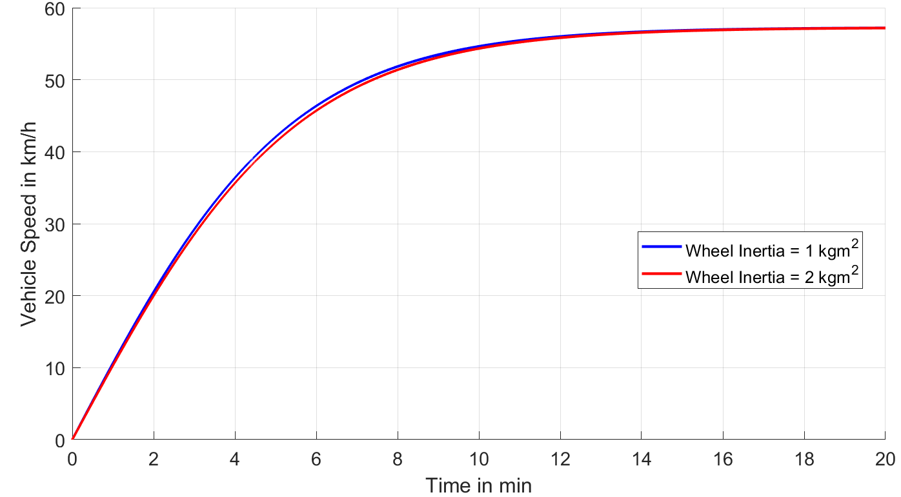 

Another example is illustrated below, where the vehicle's mass is increased. Typically, if the mass increase were the sole factor, the vehicle would still reach the same maximum speed, as the mass functions like inertia, storing energy. However, increasing the mass also elevates the rolling resistance.
As a result, the total resistance rises, and with the same torque of 100 Nm applied, the attainable maximum speed is reduced.

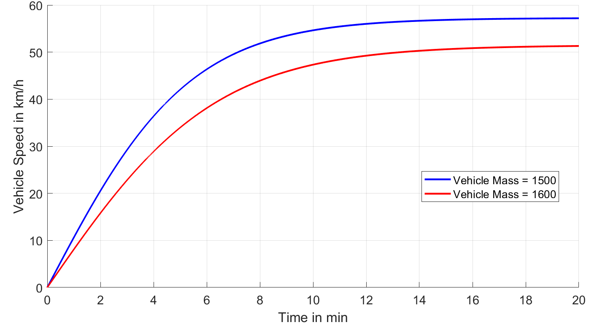 

## Vehicle, Tires and Gearbox
The model [vehicleModelGearbox.slx](models/vehicleModelGearbox.slx) extends [vehicleModelBodyAndTires.slx](models/vehicleModelBodyAndTires.slx) with a gearbox. A constant torque (100 Nm) is provided to the gearbox, which converts torque and angular speed and transmits them to the rear wheels. The gearbox losses are modeled with a constant efficiency (98%).

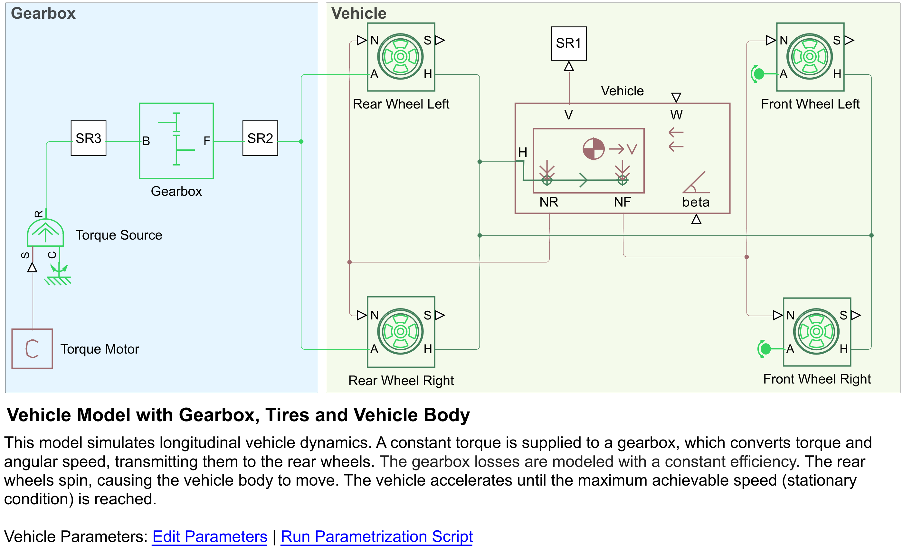 

The vehicle accelerates until the power provided by the torque source is balanced by losses (at this point the maximum attainable speed is reached). The losses accounted in this model are the tire, drag, and gearbox losses.
The torque source of 100 Nm is amplified by the transmission ratio, allowing the vehicle to achieve higher speeds due to the increased torque delivered to the wheels. The figure below illustrates the maximum speed attainable for different transmission ratios. 
The current model assumes that this torque remains constant regardless of wheel speed, which is a simplification that does not accurately reflect the real torque characteristics of electric machines.

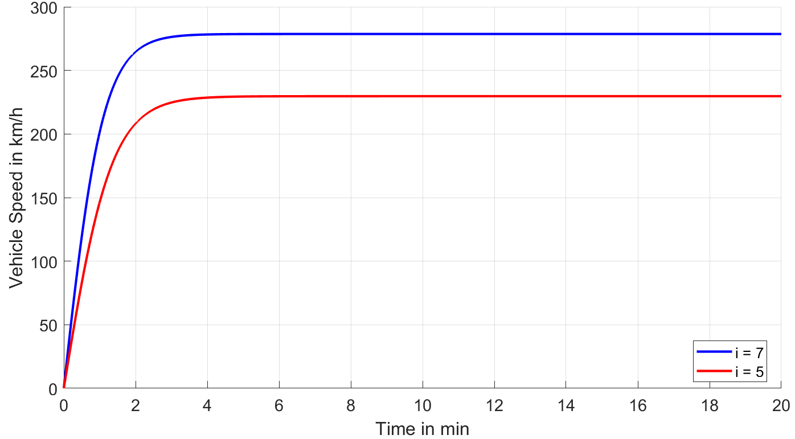 

## Vehicle, Tires, Gearbox, and Electric Machine
The model [vehicleModelMotor.slx](models/vehicleModelMotor.slx) extends [vehicleModelGearbox.slx](models/vehicleModelGearbox.slx) with an electric machine model. A constant torque (100 Nm) is requested to the electric machine and transmitted to the gearbox. 
The electric machine will provide the requested torque based on its characteristics (torque vs. speed envelope). The machine draws current from an ideal voltage source, which accounts for the battery. The battery is modeled as an infinite source of voltage.

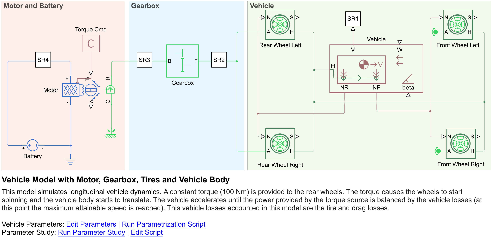 

The vehicle accelerates until the power provided by the machine is balanced by losses (at this point the maximum attainable speed is reached). The losses accounted in this model are tire, drag, gearbox, and machine losses.
Latter are modeled using a lookup table that defines efficiency based on torque and speed. This approach accurately captures the torque versus speed behavior of the electric machine. The figure below compares this model to one without an electric machine. 
It is evident that the model with the electric machine cannot maintain a constant torque of 100 Nm throughout the entire simulation. As the machine reaches its maximum power output, a torque derating becomes apparent.

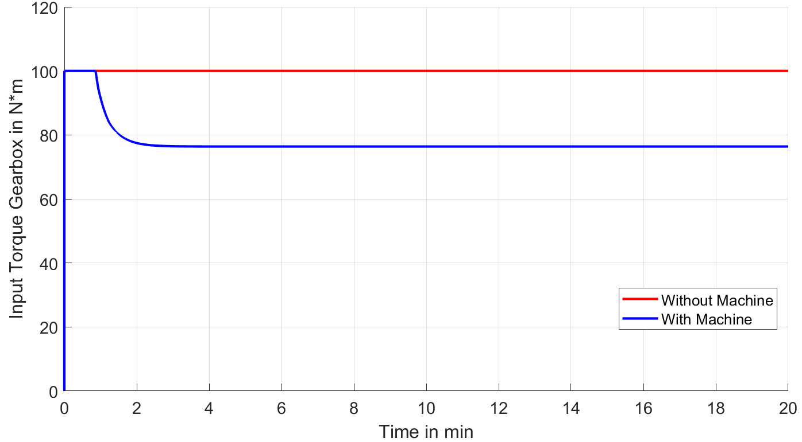

## Closed-Loop Vehicle
The model [vehicleModelDriveCycle.slx](models/vehicleModelDriveCycle.slx) combines all previous model to create a closed loop system.
The component used in the previous models are used to create the plant model of the vehicle. A driver model controls the vehicle speed so that a prescribed drive cycle can be followed. 

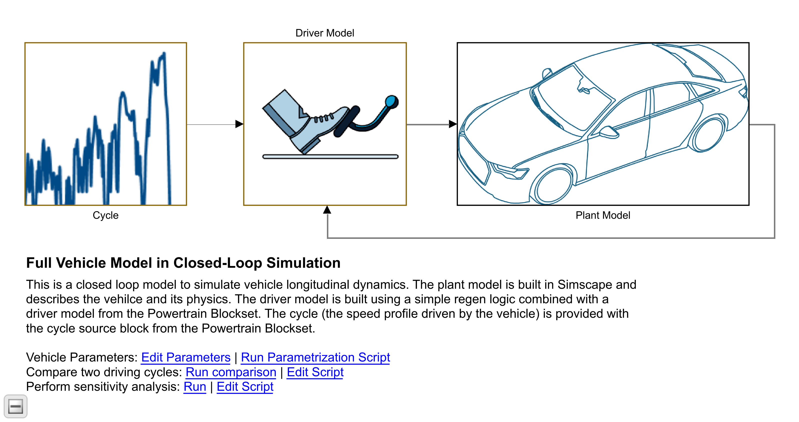

As a closed loop system, this model can simulate entire drive cycles such as the WLTP and the FTP75. The figure below shows a comparison between all losses occurring during the drive cycles. 

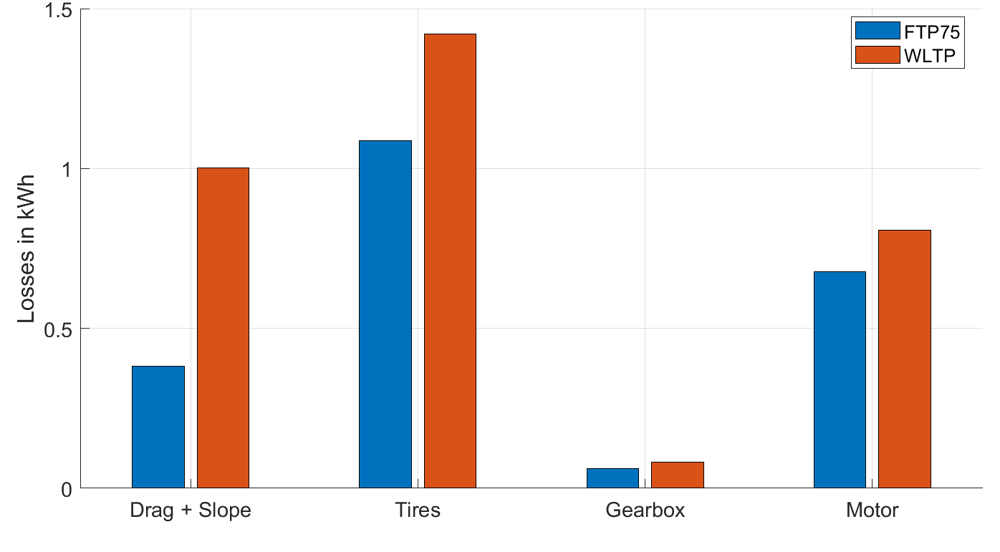

## Visuals: 
All plots shown in these readme can be created with the dedicated function linked in each Simulink model

## Installation
The model was developed in the 24b release and requires the following products:
- [MATLAB&reg;](https://www.mathworks.com/products/matlab.html);
- [Simulink&reg;](https://www.mathworks.com/products/simulink.html);
- [Simscape&trade;](https://www.mathworks.com/products/simscape.html);
- [Simscape Driveline&trade;](https://www.mathworks.com/products/simscape-driveline.html);
- [Simscape Electrical&trade;](https://www.mathworks.com/products/simscape-electrical.html);
- [Powertrain Blockset&trade;](https://www.mathworks.com/products/powertrain.html);

To use all drive cycles, it is required to install the [Powertrain Blockset Drive Cycle Data](https://www.mathworks.com/matlabcentral/fileexchange/59683-powertrain-blockset-drive-cycle-data) Add-On

## Authors and acknowledgment
- Lorenzo Nicoletti, Ph.D., [LinkedIn](https://www.linkedin.com/in/lorenzonicolettiphd/)
- Steve Miller